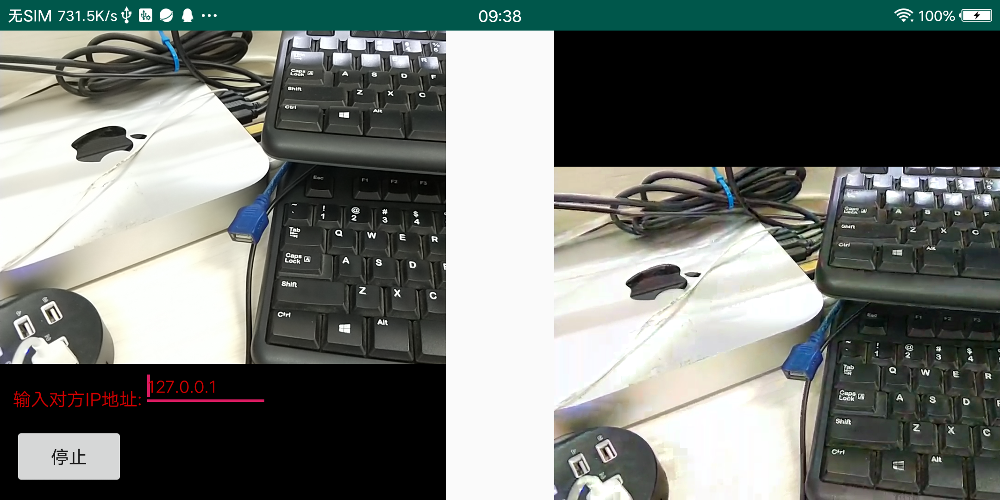

# Communication
Android平台 点对点 音视频对讲 [项目链接](https://github.com/yuzhihui170/Communication)
https://github.com/yuzhihui170/Communication

## 本项目提供Android平台点对点音视频对讲功能，项目的基本架构如下:
1. Android Camera2 API 采集预览视频
2. MediaCodec 进行硬编码，编码成h264视频文件
3. AudioRecord采集音频PCM数据，同样利用MediaCodec编码成AAC数据
4. jrtplib库进行视频音频数据发送，本项目修改jrtplib库，添加了大数据切片功能，方便进行网络传输
5. ffmpeg对接收到的数据进行解码，利用ffmpeg软解码的原因是减少延时，Android硬解码由于机制问题，会存在
    缓冲队列，导致延时过大，ffmpeg能够很好解决这个问题。
6. 利用SurfaceTexture进行绘制，在JNI层直接将解码的RGB数据拷贝到Surface中，减少数据传递

## Demo使用

在IP填写EditView内，输入对方的IP即可。测试时可以输入127.0.0.1，自己给自己发送数据也可以进行测试。

## 项目未解决问题
音视频对讲时，存在回声问题，需要对回声进行抑制，这里需要加入适当算法进行处理。

[1]: screenshot/1.png